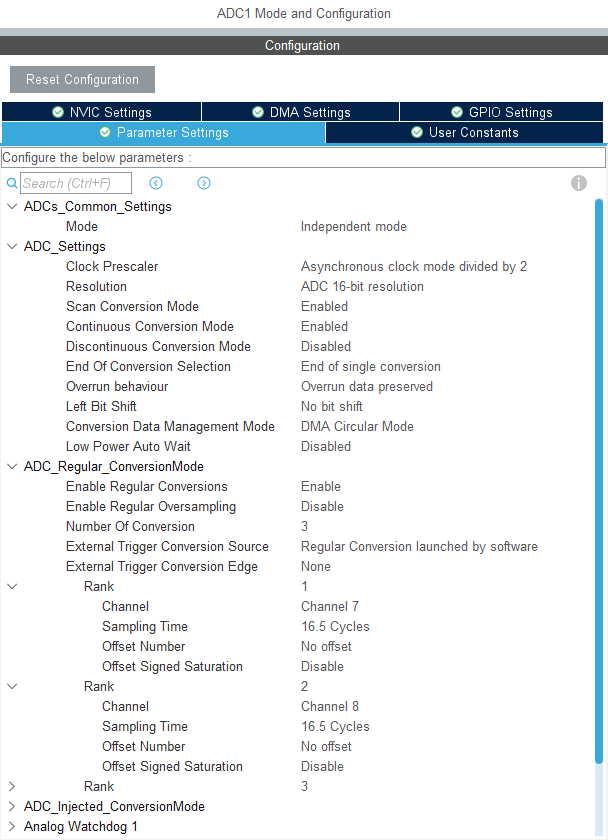
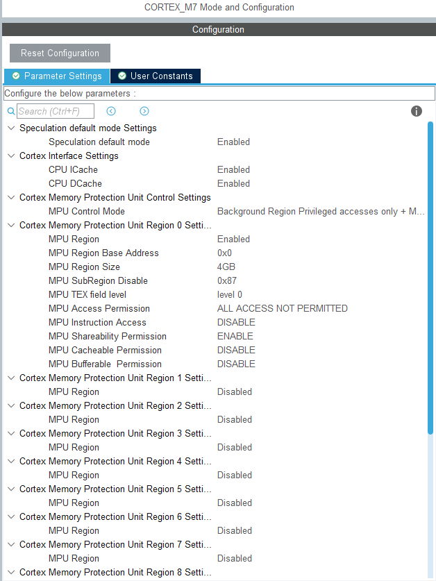

# ...

## CubeMX配置

...

| CubeMX_ADC_配置                   | CORTEX_M7配置                   |
| --------------------------------- | ------------------------------- |
|  |  |

...

## ADC DMA Buffer

```c
/* Definition of ADCx conversions data table size */
#define ADC_CONVERTED_DATA_BUFFER_SIZE   ((uint32_t)  32)   /* Size of array aADCxConvertedData[] */

/* Variable containing ADC conversions data */
ALIGN_32BYTES (static uint16_t   aADCxConvertedData[ADC_CONVERTED_DATA_BUFFER_SIZE]);
```

...

## ADC设置

```c
/* ### - 1 - Initialize ADC peripheral #################################### */
AdcHandle.Instance          = ADCx;
if (HAL_ADC_DeInit(&AdcHandle) != HAL_OK)
{
    /* ADC de-initialization Error */
    Error_Handler();
}

AdcHandle.Init.ClockPrescaler           = ADC_CLOCK_ASYNC_DIV2;          /* Asynchronous clock mode, input ADC clock divided by 2*/
AdcHandle.Init.Resolution               = ADC_RESOLUTION_16B;            /* 16-bit resolution for converted data */
AdcHandle.Init.ScanConvMode             = DISABLE;                       /* Sequencer disabled (ADC conversion on only 1 channel: channel set on rank 1) */
AdcHandle.Init.EOCSelection             = ADC_EOC_SINGLE_CONV;           /* EOC flag picked-up to indicate conversion end */
AdcHandle.Init.LowPowerAutoWait         = DISABLE;                       /* Auto-delayed conversion feature disabled */
AdcHandle.Init.ContinuousConvMode       = ENABLE;                        /* Continuous mode enabled (automatic conversion restart after each conversion) */
AdcHandle.Init.NbrOfConversion          = 1;                             /* Parameter discarded because sequencer is disabled */
AdcHandle.Init.DiscontinuousConvMode    = DISABLE;                       /* Parameter discarded because sequencer is disabled */
AdcHandle.Init.NbrOfDiscConversion      = 1;                             /* Parameter discarded because sequencer is disabled */
AdcHandle.Init.ExternalTrigConv         = ADC_SOFTWARE_START;            /* Software start to trig the 1st conversion manually, without external event */
AdcHandle.Init.ExternalTrigConvEdge     = ADC_EXTERNALTRIGCONVEDGE_NONE; /* Parameter discarded because software trigger chosen */
AdcHandle.Init.ConversionDataManagement = ADC_CONVERSIONDATA_DMA_CIRCULAR; /* ADC DMA circular requested */
AdcHandle.Init.Overrun                  = ADC_OVR_DATA_OVERWRITTEN;      /* DR register is overwritten with the last conversion result in case of overrun */
AdcHandle.Init.OversamplingMode         = DISABLE;                       /* No oversampling */
/* Initialize ADC peripheral according to the passed parameters */
if (HAL_ADC_Init(&AdcHandle) != HAL_OK)
{
    Error_Handler();
}


/* ### - 2 - Start calibration ############################################ */
if (HAL_ADCEx_Calibration_Start(&AdcHandle, ADC_CALIB_OFFSET, ADC_SINGLE_ENDED) != HAL_OK)
{
    Error_Handler();
}

/* ### - 3 - Channel configuration ######################################## */
sConfig.Channel      = ADCx_CHANNEL;                /* Sampled channel number */
sConfig.Rank         = ADC_REGULAR_RANK_1;          /* Rank of sampled channel number ADCx_CHANNEL */
sConfig.SamplingTime = ADC_SAMPLETIME_8CYCLES_5;   /* Sampling time (number of clock cycles unit) */
sConfig.SingleDiff   = ADC_SINGLE_ENDED;            /* Single-ended input channel */
sConfig.OffsetNumber = ADC_OFFSET_NONE;             /* No offset subtraction */
sConfig.Offset = 0;                                 /* Parameter discarded because offset correction is disabled */
if (HAL_ADC_ConfigChannel(&AdcHandle, &sConfig) != HAL_OK)
{
    Error_Handler();
}

/* ### - 4 - Start conversion in DMA mode ################################# */
if (HAL_ADC_Start_DMA(&AdcHandle,
                      (uint32_t *)aADCxConvertedData,
                      ADC_CONVERTED_DATA_BUFFER_SIZE
                     ) != HAL_OK)
{
    Error_Handler();
}
```

...

## 转换回调函数

```c

/**
  * @brief  Conversion complete callback in non-blocking mode
  * @param  hadc: ADC handle
  * @retval None
  */
void HAL_ADC_ConvHalfCpltCallback(ADC_HandleTypeDef* hadc)
{
  /* Invalidate Data Cache to get the updated content of the SRAM on the first half of the ADC converted data buffer: 32 bytes */
  SCB_InvalidateDCache_by_Addr((uint32_t *) &aADCxConvertedData[0], ADC_CONVERTED_DATA_BUFFER_SIZE);
}

/**
  * @brief  Conversion DMA half-transfer callback in non-blocking mode
  * @param  hadc: ADC handle
  * @retval None
  */
void HAL_ADC_ConvCpltCallback(ADC_HandleTypeDef* hadc)
{
   /* Invalidate Data Cache to get the updated content of the SRAM on the second half of the ADC converted data buffer: 32 bytes */
  SCB_InvalidateDCache_by_Addr((uint32_t *) &aADCxConvertedData[ADC_CONVERTED_DATA_BUFFER_SIZE/2], ADC_CONVERTED_DATA_BUFFER_SIZE);
}

```

....


